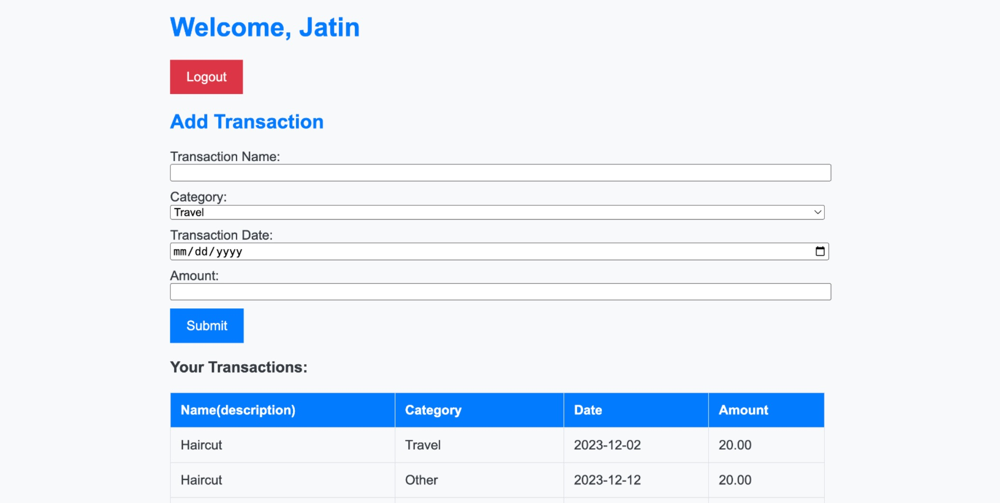
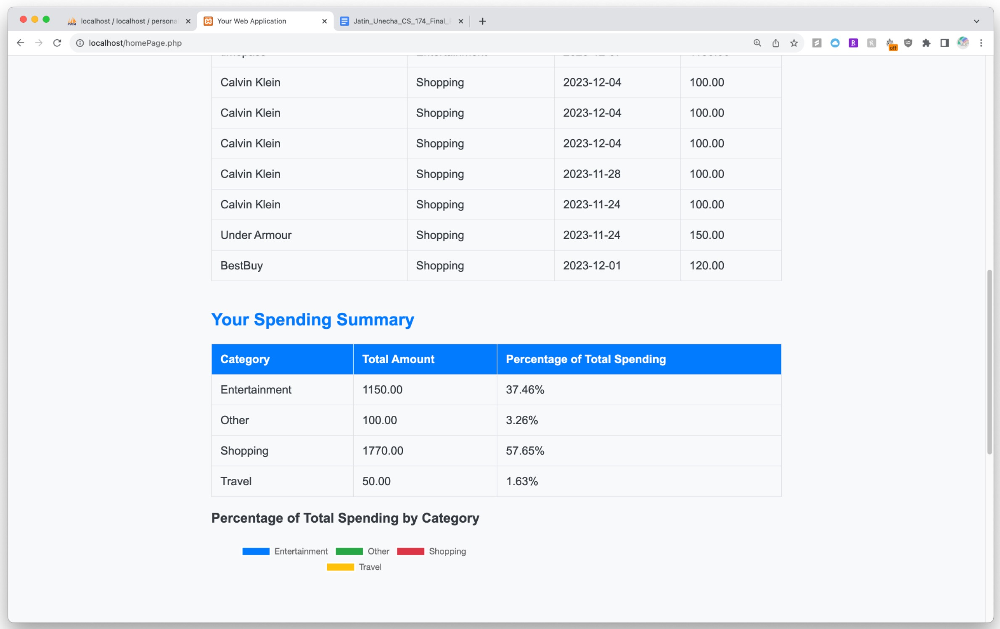
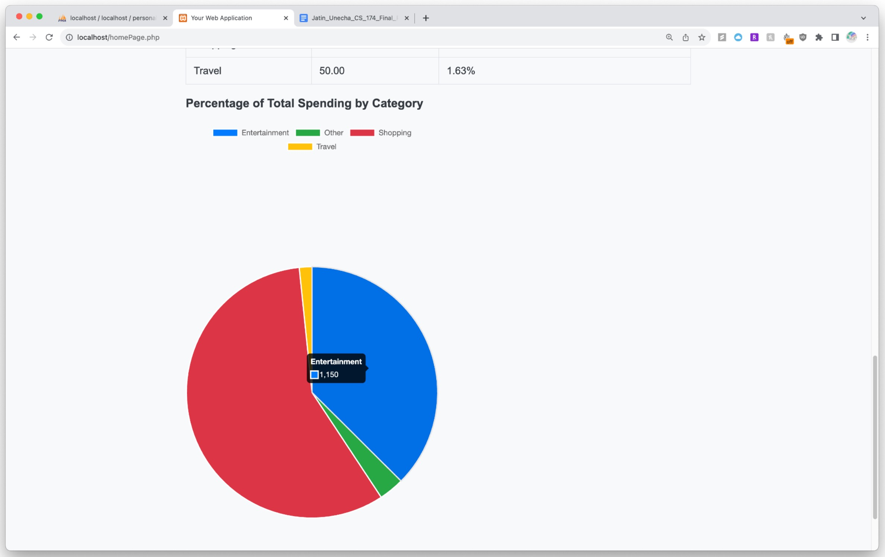
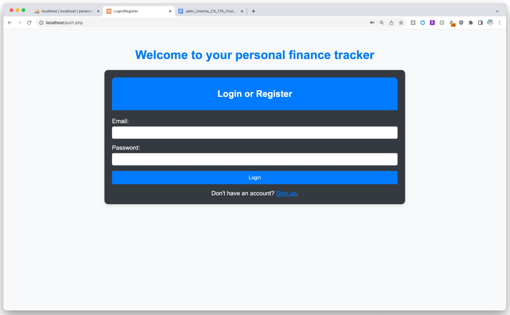
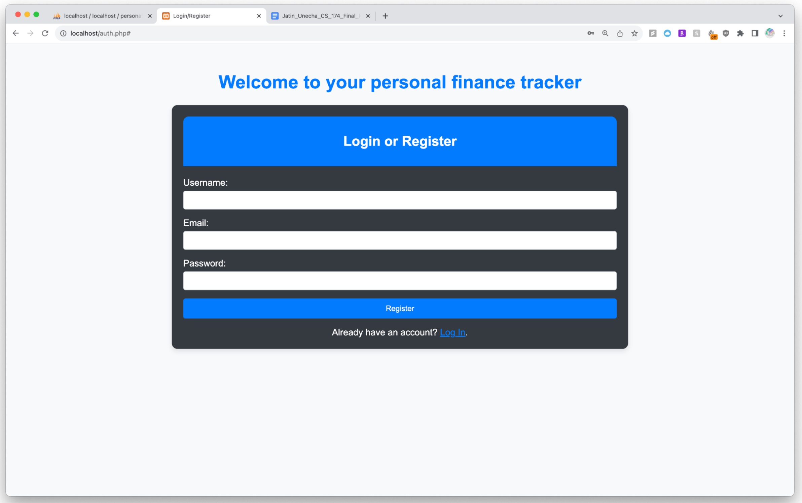

# Personal Finance Tracker

---

## Description

The Personal Finance Tracker is a web-based application designed to empower users to manage and analyze their financial transactions effectively. This README provides an overview of the application's features, technologies used, and instructions for running the app locally.

---

## Key Features

- **Transaction Management:** Record and categorize financial transactions.
- **Data Visualization:** Visualize spending patterns with dynamic charts.
- **User Authentication:** Secure login to protect user data.
- **Responsive UI:** Accessible across devices for convenience.
- **Customization:** Customize categories and budgets to suit individual needs.

---

## Technologies Used

- **Frontend:** HTML, CSS, JavaScript, Bootstrap
- **Backend:** PHP, MySQL
- **Additional Tools:** Chart.js, Git

---

## Screenshots

- Homepage 
  
- Homepage - transactions table 
  
- Homepage - spending categories pie chart
  
- Login Page 
- Signup Page 

---
<!-- 
## Getting Started

1. **Clone the Repository:**
   ```bash
   git clone https://github.com/jsunecha/personal-finance-tracker.git -->
